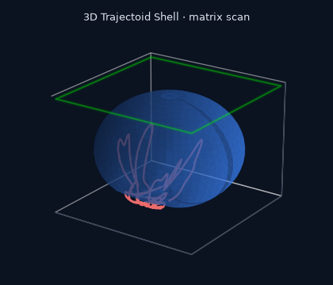
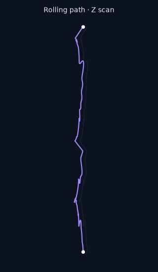
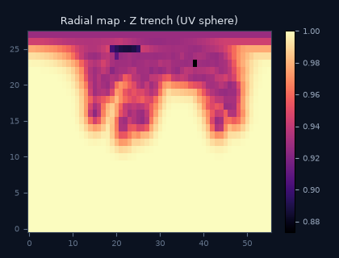
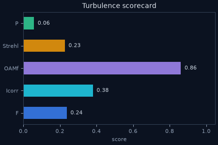
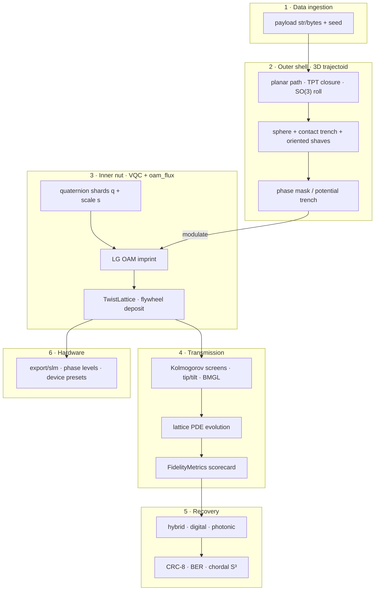

# flux_trajectoid

**Photon Seed Asteroids** — 3D trajectoid shells + VQC quaternion/OAM + live `oam_flux` Hopf lattice for robust photonic data carriers.

[](https://www.python.org/downloads/)
[](LICENSE)
[](https://huggingface.co/spaces/kinaar111/flux_trajectoid)
[](https://x.com/kinaar111/status/2075134240703029650)

Inspired by **macadamia nuts** (hard shell, dense kernel) and **[trajectoids](https://en.wikipedia.org/wiki/Trajectoid)** (3D bodies whose rolling path encodes a prescribed curve — Sobolev et al., *Nature* 2023), this project models a layered biomimetic photonic packet that propagates as a protected “seed” through simulated optical channels — and exports SLM-ready holograms.

| | |
|---|---|
| **GitHub** | https://github.com/kinaar8340/flux_trajectoid |
| **Interactive demo** | https://huggingface.co/spaces/kinaar111/flux_trajectoid |
| **Demo video** | https://x.com/kinaar111/status/2075134240703029650 |

---

## Demo video

Silent ~11s walkthrough of the public Gradio Space: **Build → matrix slice → rolling path / radial trench / scorecard** (synced X/Y/Z scans).

[](https://x.com/kinaar111/status/2075134240703029650)

<p align="center">
  <a href="https://x.com/kinaar111/status/2075134240703029650">
    
  </a>
  &nbsp;
  <a href="https://huggingface.co/spaces/kinaar111/flux_trajectoid">
    
  </a>
  <a href="https://huggingface.co/spaces/kinaar111/flux_trajectoid">
    
  </a>
  <a href="https://huggingface.co/spaces/kinaar111/flux_trajectoid">
    
  </a>
</p>

<p align="center"><em>Boot stills from the public Space 2×2 (shell · path · radial · scorecard). Click the shell for the X screencast; open the <a href="https://huggingface.co/spaces/kinaar111/flux_trajectoid">HF Space</a> to play live.</em></p>

**HF Space (playable):** open the [Space](https://huggingface.co/spaces/kinaar111/flux_trajectoid) → **Build** · **Play matrix scan** · **SLM export**.

---

## Why this works

| Idea | Role in flux_trajectoid |
|------|-------------------------|
| **Trajectoid scaling** | Anisotropic `(kx, ky)` + perimeter lock minimizes SO(3) rolling mismatch so the shell geometry is a reproducible ID fingerprint. |
| **3D shaved sphere** | Contact curve + oriented cutting planes turn the rolling plan into a real asteroid mesh with a potential trench. |
| **q × scale packing** | Unit quaternions alone lose bytes (S³ is 3-DOF). Scale rides on the OAM carrier amplitude → near-lossless photonic recovery on clean fields. |
| **OAM robustness** | OAM spectral fidelity decays slower under turbulence than raw field overlap — angular momentum structure is hard to scramble. |
| **Hybrid recovery** | Digital CRC-perfect path + photonic BER scorecard so you always know channel quality. |

---

## Layered architecture



**ASCII overview** (same layers):

```
Photon Seed Asteroid (flux_trajectoid)
│
├── 1. DATA INGESTION
│   └── str | bytes + seed → deterministic identity
│
├── 2. OUTER SHELL (3D trajectoid)
│   ├── Planar path from payload hash
│   ├── Path scaling + TPT closure + SO(3) rolling
│   ├── 3D mesh: sphere + contact trench + oriented shaves
│   ├── Fourier fingerprint (silhouette) + curvature signal
│   └── shell/modulator → phase mask / potential trench
│
├── 3. INNER NUT (VQC + oam_flux)
│   ├── Quaternion shards (q) + scale (s) → LG OAM imprint
│   ├── Live TwistLattice + deposit_on_flywheels
│   └── Shell-attenuated multi-ℓ coupling
│
├── 4. TRANSMISSION
│   ├── Kolmogorov phase screens + tip/tilt + BMGL gate
│   ├── Lattice PDE evolution
│   └── FidelityMetrics scorecard + sweep_turbulence()
│
├── 5. RECOVERY
│   ├── Shell ID (Fourier cosine match)
│   ├── digital | photonic | hybrid (CRC-8)
│   └── Flywheel emergence probe
│
└── 6. HARDWARE HOOK
    └── export/slm → phase maps, GS option, device presets
```

Full design notes: **[docs/architecture.md](docs/architecture.md)** · metrics guide: **[docs/metrics.md](docs/metrics.md)** · vignettes: **[docs/gallery.md](docs/gallery.md)**.

---

## Key results

Illustrative numbers from the default demo stack (`force_stub_flux=True` for CI-friendly speed; live `oam_flux` when the submodule is present). Re-run with `examples/propagate_seed.py` / `examples/create_seed.py` to regenerate.

### Trajectoid mismatch reduction

Path scaling + TPT closure cuts SO(3) rolling mismatch on the prescribed curve:

| Stage | Mismatch |
|-------|----------|
| Base path (pre-scale) | **~147.6°** |
| After `(kx, ky)` + perimeter lock | **~36.1°** |
| Final reported shell mismatch | **~69.0°** (post-build, 3D mesh on) |

Roughly a **~4×** reduction from base → scaled plan before mesh integration — the shell geometry stays a stable ID fingerprint rather than an unconstrained random polyhedron.

### OAM fidelity under turbulence

Same seed, increasing Kolmogorov-like turbulence (`n_steps=12`):

| Turbulence | Field **F** | **OAMf** | **Icorr** | **Strehl** | Photonic BER |
|------------|-------------|----------|-----------|------------|--------------|
| 0.00 | 0.25 | **0.97** | 0.43 | 0.47 | high* |
| 0.10 | 0.22 | **0.95** | 0.43 | 0.43 | high* |
| 0.25 | 0.16 | **0.91** | 0.42 | 0.36 | high* |
| 0.50 | 0.06 | **0.73** | 0.42 | 0.22 | high* |

\*Photonic-only BER is intentionally harsh on short stub runs — the point is the **relative** resilience of **OAMf vs F**: angular-momentum structure survives while coherent field overlap collapses.

### Hybrid recovery

| Mode | Clean / after channel |
|------|------------------------|
| **hybrid** | CRC-correct payload text (`crc_ok=True`) + photonic BER scorecard |
| **digital** | ShardPack + CRC-8 only |
| **photonic** | Field LG projection → `(q, s)` → bytes (channel-limited) |

```text
Hybrid recover: "Hello from the shell"  crc=True
```

**Takeaway for demos and hardware:** track **OAMf + BER** alongside **F** — not F alone. See **[docs/metrics.md](docs/metrics.md)**.

```python
rows = ast.sweep_turbulence(levels=[0.0, 0.25, 0.5], n_steps=12)
for r in rows:
    print(r["turbulence_level"], r["overlap_fidelity"], r["oam_fidelity"])
```

---

## Install

```bash
git clone --recurse-submodules https://github.com/kinaar8340/flux_trajectoid.git
cd flux_trajectoid
python -m venv .venv && source .venv/bin/activate
pip install -e ".[dev]"
```

Submodules (use `--recurse-submodules`):

| Path | Role |
|------|------|
| `external/oam_flux` | Live Hopf lattice + VQC flux deposition |
| `external/vqc_proto` | Quaternion / Orbital Braille reference |
| `external/vqc_sims_public` | Photonics simulation lineage |

```python
from flux_trajectoid import oam_flux_backend, is_live_oam_flux
print(oam_flux_backend(), is_live_oam_flux())
# → "live" True   (or stub fallback if submodule not on path)
```

---

## Quickstart

### End-to-end (API)

```python
from flux_trajectoid import PhotonSeedAsteroid

ast = PhotonSeedAsteroid("Hello from the shell", seed=42).build(
    lattice_nx=16,
    n_coupling_steps=12,
    use_tpt=True,
    build_3d=True,       # 3D shaved-sphere shell (default)
)

print(ast.summary())
# is_3d, mesh_vertices, mismatch_deg, flux_backend, ...

prop = ast.propagate(turbulence_level=0.35, n_steps=24)
print(prop.metrics.summary_line())
# F=… Icorr=… Strehl=… φrms=… OAM=… tt=…

rec = ast.recover(mode="hybrid")
print(rec.payload_text, rec.crc_ok, rec.byte_error_rate, rec.chordal_error_mean)

pkg = ast.export_slm("outputs/slm_package", preset="generic_256")
print(pkg.files)
```

### Examples (CLI)

```bash
python examples/create_seed.py       # shell + mesh + protected field plot
python examples/propagate_seed.py    # turbulence scorecard table
python examples/recover_seed.py      # digital / photonic / hybrid
python examples/export_slm.py        # SLM package on disk
```

### Interactive Gradio Space (local)

```bash
pip install -r space/requirements.txt
PYTHONPATH=src python space/app.py
# → http://127.0.0.1:7860
```

Public Space: [kinaar111/flux_trajectoid](https://huggingface.co/spaces/kinaar111/flux_trajectoid)

| Control | Action |
|---------|--------|
| **Build** | shell → encode → propagate → recover · fill 2×2 plots |
| **Play matrix scan** | synced shell / radial / path GIFs (x · y · z · **xyz**) |
| **SLM export** | download phase hologram zip (device presets) |
| **REFERENCES** | panel legend + scorecard keys |

---

## Advanced usage

### Recovery modes

| Mode | Behavior |
|------|----------|
| `hybrid` (default) | Lossless digital payload + photonic BER / chordal metrics |
| `digital` | ShardPack blocks only (CRC-8) |
| `photonic` | Field-only LG projection → `(q, s)` → bytes |

### Build knobs

```python
ast = PhotonSeedAsteroid(payload, seed=42).build(
    use_tpt=True,            # Two-Period Trajectoid path closure
    build_3d=True,           # 3D mesh + trench (False → planar path only)
    force_stub_flux=False,   # True → fast numpy stub (CI / Space default)
    lattice_nx=16,           # oam_flux lattice resolution
    n_coupling_steps=12,     # multi-ℓ coupling iterations
    n_shards=4,              # quaternion shard count
    redundancy=1,            # majority-vote shards (if >1)
)
```

### Turbulence sweep

```python
rows = ast.sweep_turbulence(
    levels=[0.0, 0.1, 0.2, 0.3, 0.5],
    n_steps=12,
    recover_photonic=True,
)
for r in rows:
    print(
        r["turbulence_level"],
        r["overlap_fidelity"],
        r["oam_fidelity"],
        r.get("photonic_byte_ber"),
    )
```

### SLM export (hardware)

```python
pkg = ast.export_slm(
    "outputs/slm_package",
    preset="generic_256",   # also: generic_512, holoeye_pluto_2, meadowlark_512, ...
    source="protected",
    stack_shards=True,
    include_shell_bias=True,
    use_gs=False,           # optional Gerchberg–Saxton refinement
)
# → phase_rad.npy, phase_levels.npy/.png/.raw, manifest.json, previews
```

### Metrics at a glance

| Field | Symbol | Meaning |
|-------|--------|---------|
| `overlap_fidelity` | **F** | Field fidelity \|⟨ref\|obs⟩\|² |
| `oam_fidelity` | **OAMf** | LG spectrum cosine similarity |
| `intensity_correlation` | **Icorr** | Intensity-map Pearson correlation |
| `strehl_proxy` | **Strehl** | Peak intensity ratio |
| `power_retention` | **P** | Total power ratio |
| `phase_rmse_rad` | **φrms** | Intensity-weighted phase error |
| `tip_tilt_rms` | **tt** | Residual pointing energy |

Full guide: **[docs/metrics.md](docs/metrics.md)**.

### Config

Default knobs live in [`configs/default.yaml`](configs/default.yaml). The Gradio Space vendors a copy of the package under `space/flux_trajectoid/` for HF deploy.

---

## Project layout

```
flux_trajectoid/
├── configs/default.yaml
├── docs/
│   ├── architecture.md
│   ├── metrics.md
│   └── gallery.md
├── examples/
├── space/                        # HF Space root (Gradio)
│   ├── app.py
│   ├── demo_core.py
│   └── assets/
├── src/flux_trajectoid/
│   ├── photon_seed_asteroid.py   # orchestrator
│   ├── shell/                    # 3D trajectoid + modulator
│   ├── inner/                    # VQC + live oam_flux
│   ├── propagation/              # channel + metrics
│   ├── recovery/                 # hybrid decoder
│   ├── export/                   # SLM holograms
│   └── utils/
├── tests/
└── external/                     # git submodules
```

---

## Related projects

| Repo | Role |
|------|------|
| [vqc_proto](https://github.com/kinaar8340/vqc_proto) | Quaternion + Orbital Braille / OAM imprint |
| [oam_flux](https://github.com/kinaar8340/oam_flux) | Helical packets, Hopf lattice, flux flywheels |
| [vqc_sims_public](https://github.com/kinaar8340/vqc_sims_public) | Photonics simulation lineage |

---

## License

MIT — see [LICENSE](LICENSE).
